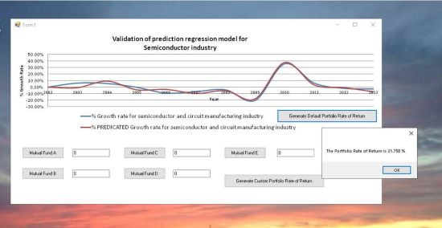

## Portfolio Return Graphical User Interface

The project consists of a custom investment portfolio with an initial individual investment upwards of $20,000. The allocation consists of mutual funds, confidential information is not displayed. The prediction  model is a custom prediction model on the United States SemiConductor Growth Rate plotted with the actual growth rate referenced from IBISWorld Industry report : Semiconductor & circuit  mfg in US. To download the executable please click on https://github.com/alpaddesai/PortfolioReturnGUI/releases. Additional details reference : https://github.com/alpaddesai/SemiconductorIndustryAnalysis

Company confidential information is not displayed. All images are either custom by Alpa D Desai. 

 

## Ethics and Excellence 

Additional reference : https://github.com/alpaddesai/BusinessDevelopmentMergersAcquisitionsIdea
